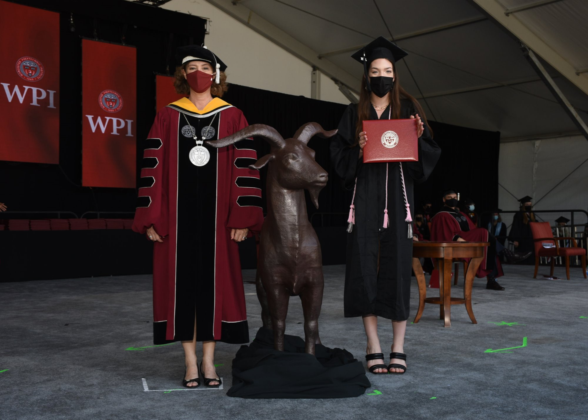

Hello, welcome to my website!

## Academics

I graduated from Worcester Polytechnic Institute in May of 2021 with a Bachelors in Biomedical Engineering! Here I am walking across the stage:

I am a first year PhD student who was/is advised by the wonderful Arturo! While he remains my adviser from slightly afar, I'll be doing rotations in other labs at UNH to find other fun projects I might be interested in if I can't be transferred to Brown.

Since I am going directly from a Bachelors to a PhD, I think I'm a bit younger (I just turned 22) than most of the DBS PhD students which is a little intimidating. I'll be sure to ask for help when I need it both from you and other students.